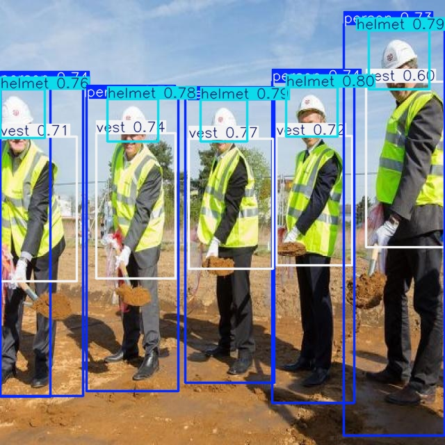
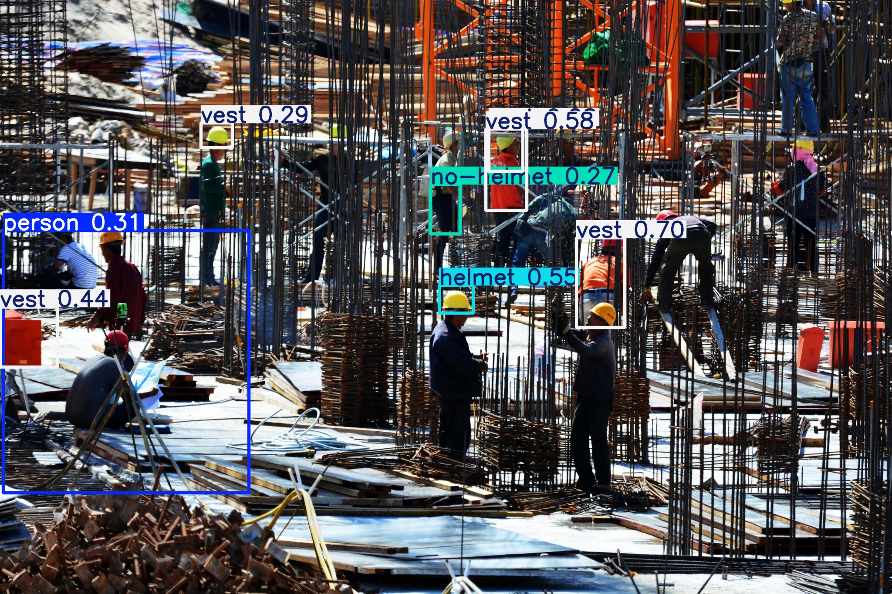
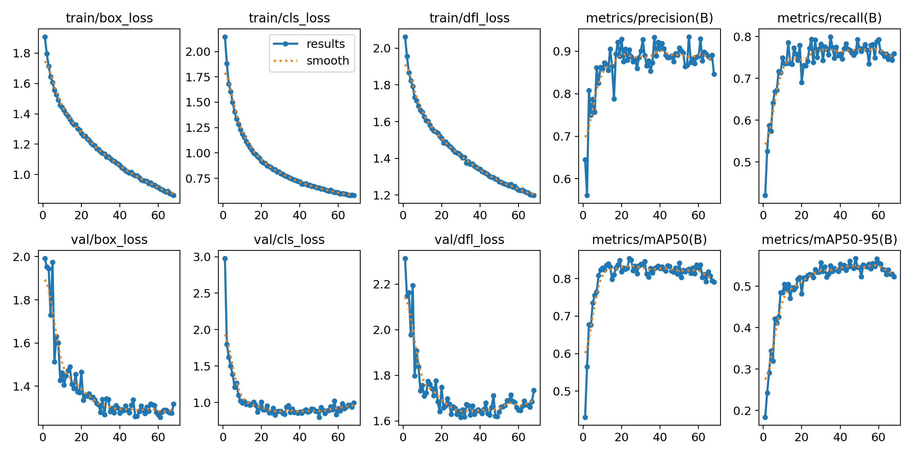

# **实时个人防护装备(PPE)检测系统 (Real-time PPE Detection System)**

  

这是一个基于 **YOLOv8** 框架的实时个人防护装备（PPE）检测项目。项目旨在通过计算机视觉技术，自动识别在工地等高危场景中，人员是否正确佩戴安全帽、穿着反光衣等，从而提升安全管理效率。 本项目最大的亮点，在于完整地展示了如何通过一个数据驱动、科学迭代的优化过程，将一个基准模型的mAP(50-95)从**0.21**，一步步地、显著地提升至**0.55**的卓越水平。

---

## 🚀 效果展示 (Demo) **最终V4.0模型在复杂真实场景下的检测效果：**   

---

## 📈 模型迭代之路：从青铜到王者 (Model Iteration: From Bronze to King)

本项目经历了四个核心版本的迭代。每一步都基于对上一版本性能瓶颈的深刻分析，并采取了针对性的优化策略。

### **V1.0: 基准模型 (Baseline Model)** 

### *   **配置:** `YOLOv8s`, 原始数据集, 基础数据增强, 50 epochs. 

### *   **诊断:** 训练曲线显示，模型在约15轮后出现**严重过拟合**，泛化能力差。

### *   **最终成绩 (mAP50-95):** **`0.21`**

### **V2.0: 抑制过拟合** 

### *   **优化策略:** 升级为`YOLOv8m`，并引入**强力数据增强** (Mosaic, Mixup等) 及**早停机制** (`patience=20`)。

### *   **结果分析:** 成功抑制过拟合，但性能提升有限。 

### *   **最终成绩 (mAP50-95):** **`0.22`**

### **V3.0: 数据清洗 -> 标签体系“正规化”** 

### *   **诊断:** 深入分析发现，原始数据集标签**极其混乱**，存在26个重复、冲突的类别。

###  *   **优化策略:** 编写`tools/clean_labels.py`脚本，将26个混乱类别，统一重新映射为`person`, `helmet`, `vest`, `no-helmet` 4个核心类别，自动清洗和重映射了 **7449** 个标注框。 

### *   **结果分析:** 使用清洗后的数据集，模型性能得到显著提升。 *   **最终成绩 (mAP50-95):** **`0.25`**

### **V4.0: 数据均衡 -> 解决“偏科”问题** 

### *   **诊断:** V3.0的类别分布分析显示，`vest`类别的样本量是其他类别的数倍，存在**严重的类别不平衡**。 

### *   **优化策略:** 编写`tools/balance_dataset_v2.py`脚本，实现智能的**欠采样(Undersampling)**与**过采样(Oversampling)**，将`vest`与其他类别的样本比例优化至健康的`~2:1`。 

### *   **最终结果分析:** **性能迎来质的飞跃！** mAP50-95从0.25**暴力拉升至 `0.55`**！

**V1.0 -> V4.0 核心指标进化史：**

| 版本     | 核心策略     | mAP50     | mAP50-95   |
| -------- | ------------ | --------- | ---------- |
| V1.0     | 基准模型     | ~0.30     | **`0.21`** |
| V2.0     | 抑制过拟合   | ~0.30     | **`0.22`** |
| V3.0     | 标签清洗     | ~0.40     | **`0.25`** |
| **V4.0** | **数据均衡** | **~0.85** | **`0.55`** |

**V4.0 "王者之师" 训练曲线全景图：**

---

## 🛠️ 如何复现 (How to Reproduce)

### 1. 环境配置 (Environment Setup) 本项目在以下Conda虚拟环境中进行开发和测试：

# 创建并激活Conda环境 

conda create --name yolov8_env python=3.9 -y conda activate yolov8_env

# 安装核心依赖 (PyTorch版本请根据你的CUDA版本从官网获取)

pip install ultralytics conda install pytorch torchvision torchaudio pytorch-cuda=12.1 -c pytorch -c nvidia

### 2. 数据集准备 (Dataset Preparation)

本项目使用的公开数据集经过了大量的清洗和均衡化处理。处理脚本位于tools/目录下。处理后的数据集结构应如下：

/your_project_root    

├── datasets/    

│   ├── train/    

│   │   ├── images/    

│   │   └── labels/   

 │   └── valid/  

  │       ├── images/   

 │       └── labels/   

 └── data.yaml

**data.yaml** **配置文件内容：**

train: ./datasets/train/images

 val: ./datasets/valid/images

 nc: 4 

names:  - person  - helmet  - vest  - no-helmet

### 3. 模型训练 (Training)

将以下代码保存为my_train.py并运行 python my_train.py，即可复现V4.0版本的训练。

import os from ultralytics import YOLO # 解决OMP Error os.environ["KMP_DUPLICATE_LIB_OK"]="TRUE" if __name__ == '__main__':    # 加载YOLOv8中号预训练模型    model = YOLO('yolov8m.pt')         # 启动训练，并传入所有优化参数    results = model.train(        # 基础指令        data='data.yaml',        imgsz=640,                # 核心优化指令        epochs=100,        patience=20,                # 数据增强参数        degrees=10.0,        translate=0.1,        scale=0.5,        shear=10.0,        perspective=0.001,        flipud=0.5,        fliplr=0.5,                # 训练参数        batch=16,        optimizer='AdamW',        lr0=0.01,                # 实验命名        project='runs/detect',        name='experiment_v4_balanced_data'    )

### 4. 模型推理 (Inference)

使用你训练好的最佳权重进行预测：

yolo predict model=runs/detect/experiment_v4_balanced_data/weights/best.pt source='path/to/your/test_image.jpg'

## 💡 总结与展望 (Conclusion & Future Work)

本项目成功地基于YOLOv8框架，实现了一个有效的PPE检测系统。最核心的收获是验证了**数据质量（标签一致性、样本均衡性）是决定模型性能上限的关键因素**。

**未来可行的优化方向：**

- **数据层面：** 针对性地补充“小目标”和“困难负样本”数据。
- **模型层面：** 尝试YOLOv9等更先进的模型架构，或引入注意力机制等模块。
- **部署层面：** 使用TensorRT对模型进行加速，并将其封装为API服务。